# 📜 Certifications & Learning Achievements

This repository serves as a centralized archive of my professional certifications and hands-on learning achievements across cybersecurity, application security, cloud platforms, and practical labs.  
It reflects my continuous learning journey and commitment to staying current with evolving technologies and security practices.

---

## Google

Certifications and learning programs completed through Google, covering foundational and advanced concepts in security, and related technologies.

  

  <em>Click image to view full certificate (PDF)</em>

  <a href="assets/pdf/Coursera 3ZAB9UXSYPDH(Course2).pdf">
    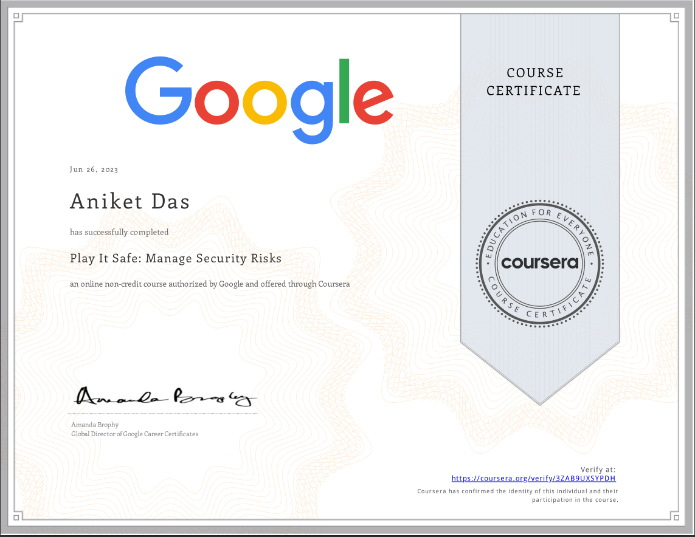
  </a>

  <em>Click image to view full certificate (PDF)</em>

  <a href="assets/pdf/Coursera KYAKNW2T5BVD(Course4).pdf">
    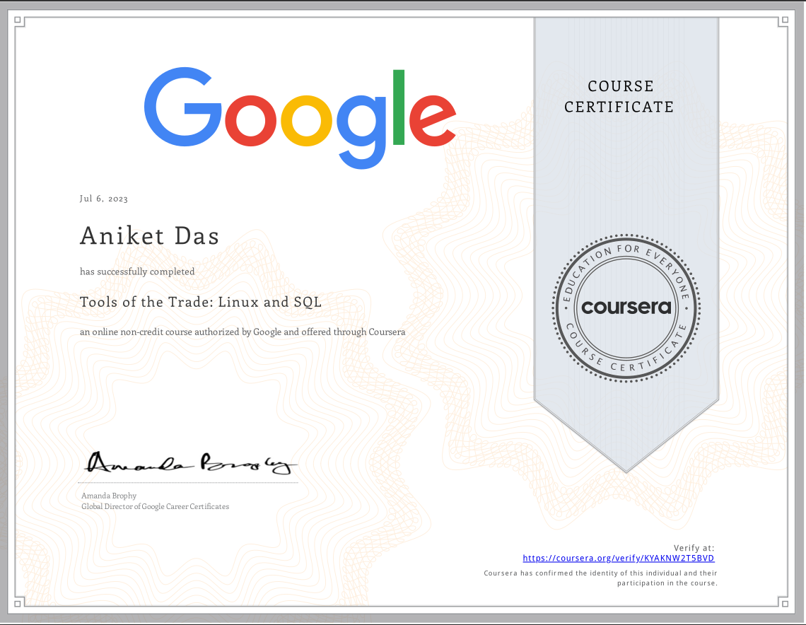
  </a>

  <em>Click image to view full certificate (PDF)</em>

  <a href="assets/pdf/Coursera VFV7VF3PBZ9C(Course3).pdf">
    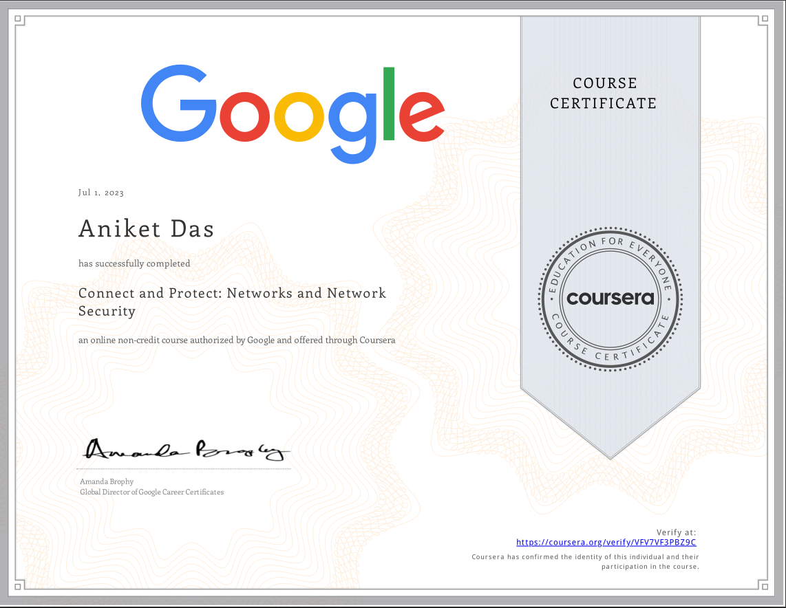
  </a>

  <em>Click image to view full certificate (PDF)</em>

---

## API Security (APISec)

Certifications focused on API security fundamentals, vulnerabilities, secure API design, and real-world attack scenarios aligned with modern application security practices.

  <a href="assets/pdf/APIsecCourseCertificate20231030-37-gfn1rw.pdf">
    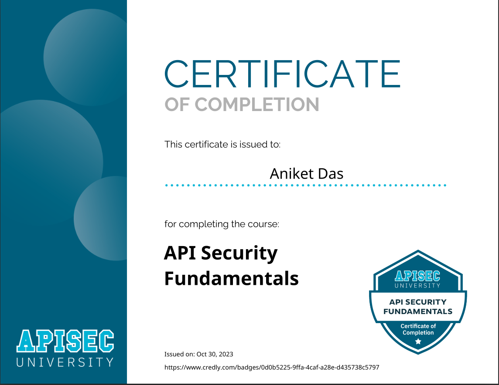
  </a>

  <em>Click image to view full certificate (PDF)</em>

  <a href="assets/pdf/APIsecCourseCertificate20231031-34-9t71gx.pdf">
    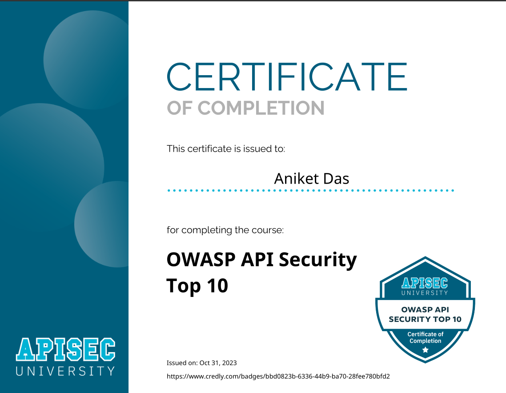
  </a>

  <em>Click image to view full certificate (PDF)</em>

---

## TryHackMe

Hands-on cybersecurity labs and learning paths completed on TryHackMe, emphasizing practical skills in penetration testing, web security, Active Directory, and defensive security.

    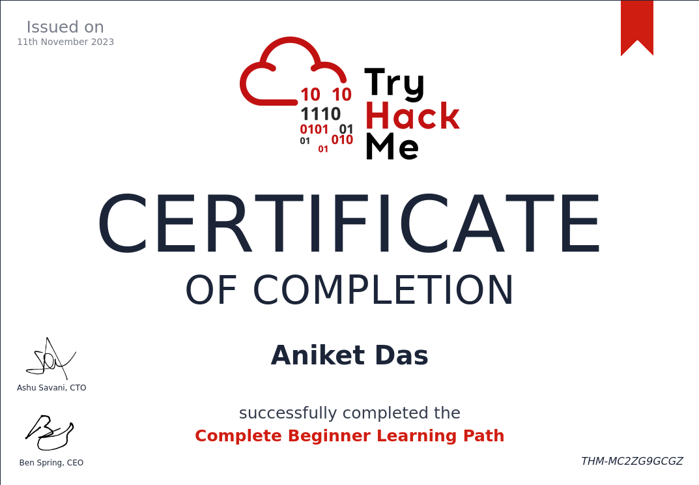
  </a>

    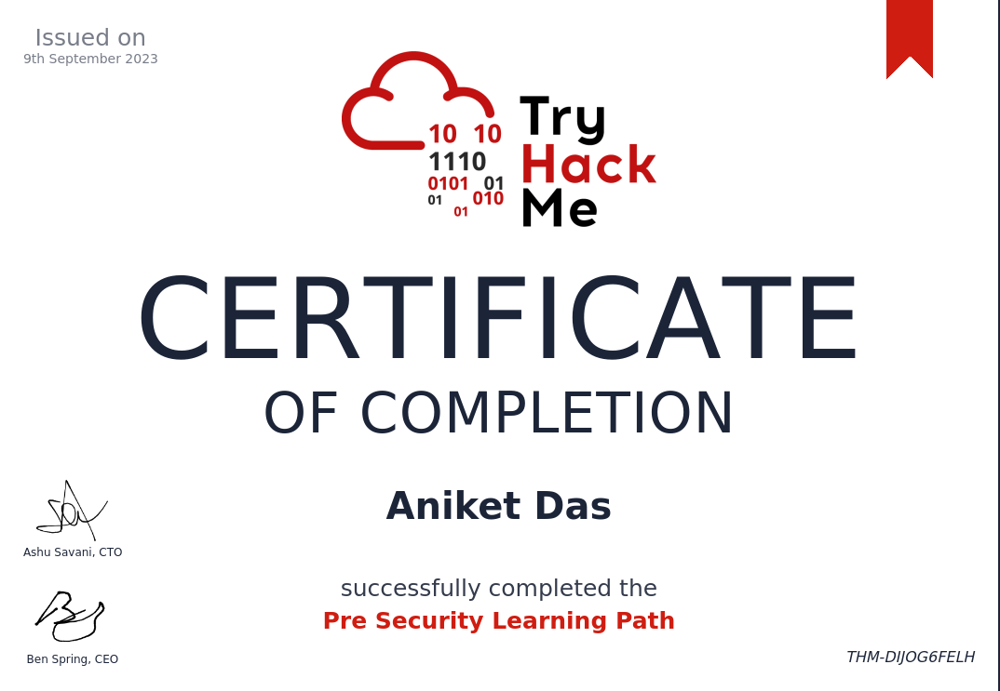
  </a>

    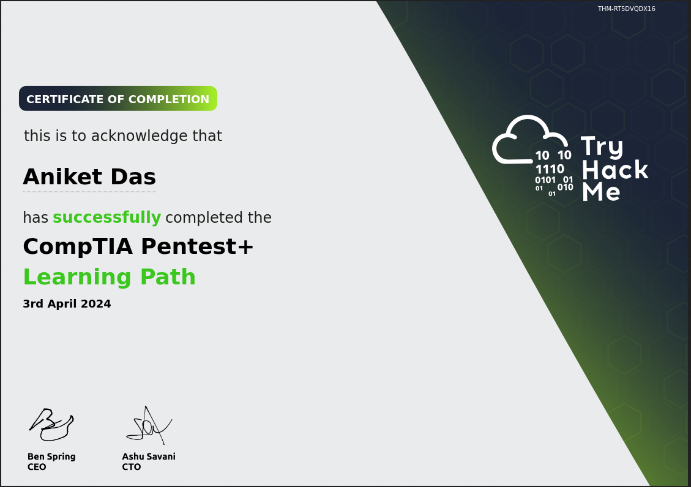
  </a>

  <a href="assets/pdf/THM-5UVYZKKPOX.pdf">
    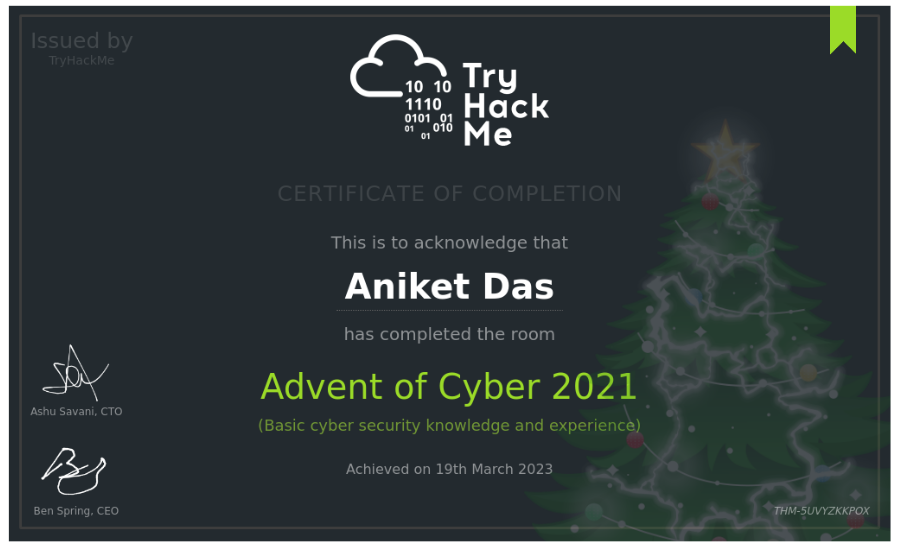
  </a>

  <em>Click image to view full certificate (PDF)</em>

  

  <em>Click image to view full certificate (PDF)</em>

---

## Cisco

Certifications and learning programs completed through Cisco, covering foundational and advanced concepts in networking, security, and related technologies.

  <a href="assets/pdf/Introduction_to_Cybersecurity_Badge20230203-30-5uhsyv.pdf">
    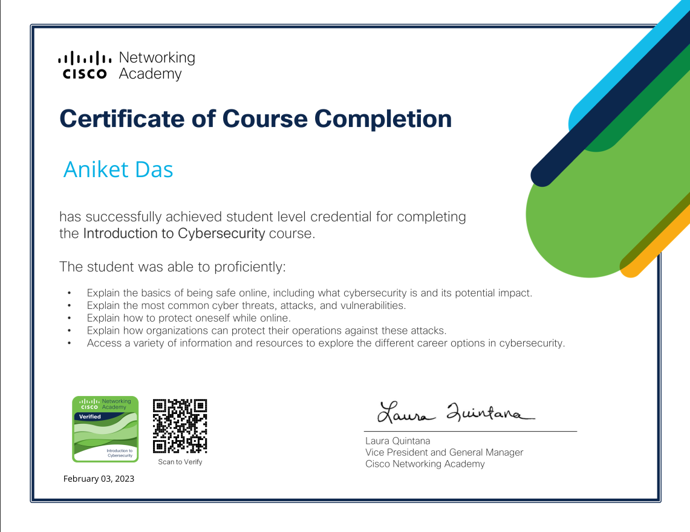
  </a>

  <em>Click image to view full certificate (PDF)</em>

  <a href="assets/pdf/Networking_Basics_Badge20230218-28-197o649.pdf">
    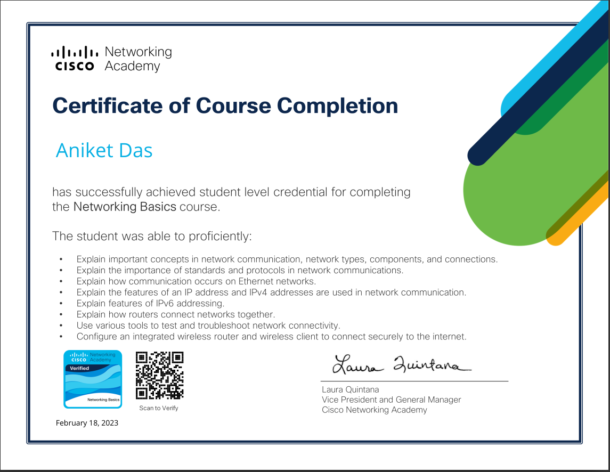
  </a>

  <em>Click image to view full certificate (PDF)</em>

  <a href="assets/pdf/Networking_Essentials_Badge20230220-28-3mfk8f.pdf">
    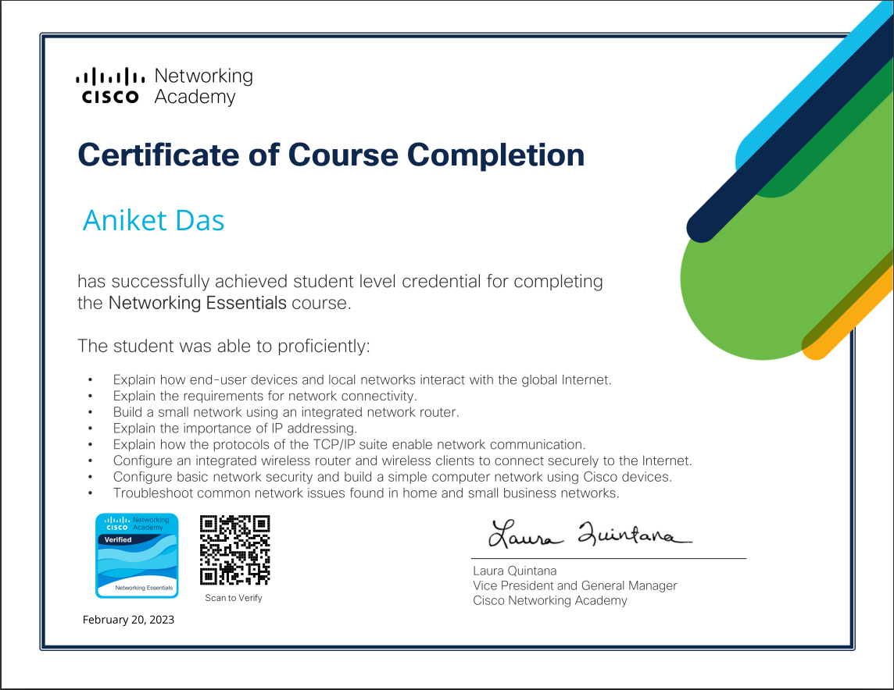
  </a>

  <em>Click image to view full certificate (PDF)</em>

---

## Others

  <a href="assets/pdf/VimForEveryone.pdf">
    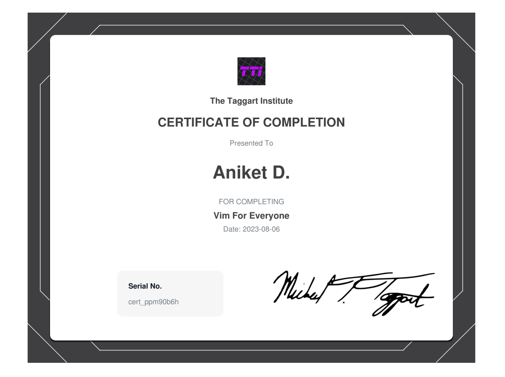
  </a>

  <em>Click image to view full certificate (PDF)</em>

---

## 📌 Notes

- All certificates are earned through structured learning and practical exercises.
- Screenshots are included for quick reference and verification.
- This repository will be continuously updated as new certifications are completed.

---

📬 **Contact / Profile**  
Feel free to explore my other repositories for projects, write-ups, and automation workflows related to cybersecurity and development.
